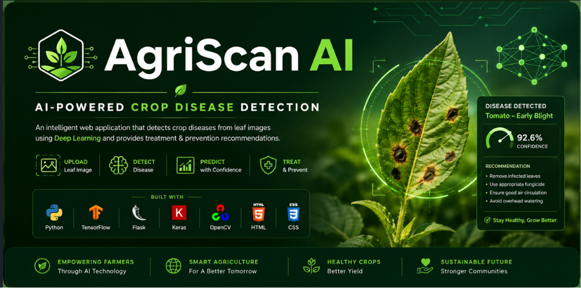
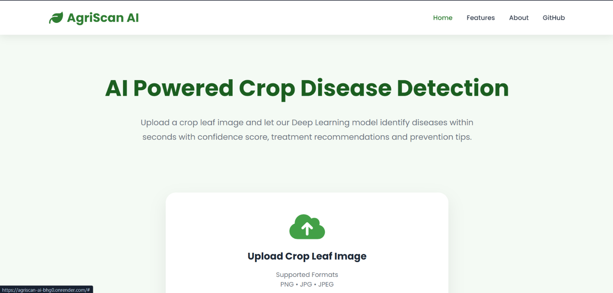
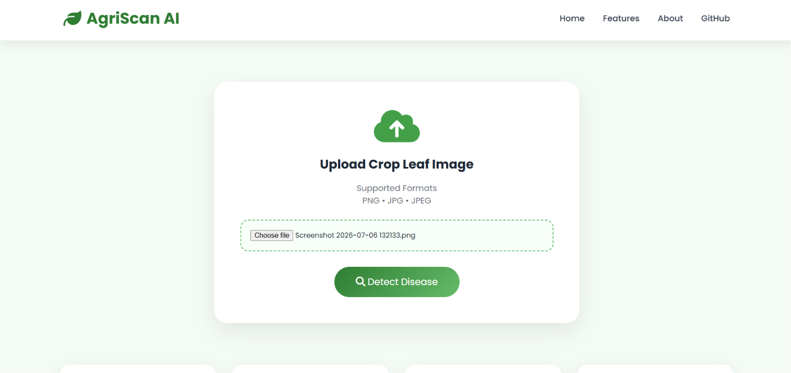
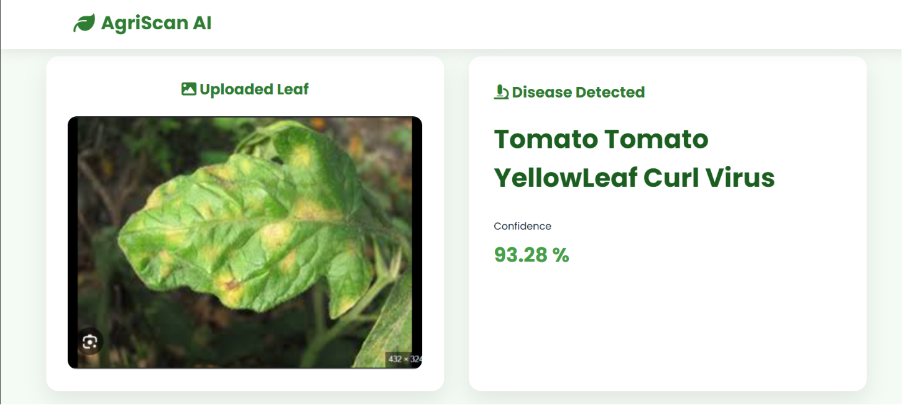

# 🌿 AgriScan AI
### AI-Powered Crop Disease Detection using Deep Learning
<p align="center">
  
</p>
<p align="center">


</p>

---

## 🌱 Overview

AgriScan AI is a Deep Learning-powered web application that identifies crop diseases from leaf images using a Convolutional Neural Network (CNN).

The application allows farmers and researchers to upload an image of a crop leaf and instantly receive:

- 🌿 Disease Name
- 📊 Prediction Confidence
- 📖 Disease Description
- 💊 Recommended Treatment
- 🛡 Prevention Tips

The model has been trained using TensorFlow & Keras and deployed using Flask.

---

# ✨ Features

- 🌿 Detects diseases from crop leaf images
- 🤖 CNN-based Deep Learning model
- 📊 Displays prediction confidence
- 📖 Disease description
- 💊 Treatment recommendations
- 🛡 Prevention methods
- 🖼 Beautiful Flask Web Interface
- ⚡ Fast predictions

---

# 🖥 Tech Stack

| Technology | Usage |
|------------|-----------------------------|
| Python | Programming Language |
| TensorFlow | Deep Learning |
| Keras | CNN Model |
| Flask | Backend |
| HTML | Frontend |
| CSS | Styling |
| JavaScript | Frontend Interactivity |
| OpenCV | Image Processing |
| Pillow | Image Handling |

---

# 🧠 Model Architecture

```
Leaf Image
      │
      ▼
Image Preprocessing
      │
      ▼
CNN Model
      │
      ▼
Disease Prediction
      │
      ▼
Confidence Score
      │
      ▼
Treatment & Prevention
```

---

# 📂 Project Structure

```
Crop-Disease-Detection/
│
├── app.py
├── crop_disease_model.h5
├── requirements.txt
├── README.md
│
├── static/
│   ├── css/
│   │      style.css
│   ├── js/
│   │      main.js
│   ├── uploads/
│   └── images/
│
└── templates/
    ├── index.html
    └── result.html
```

---

# 🚀 Installation

Clone the repository

```bash
git clone https://github.com/YOUR_USERNAME/AgriScan-AI.git
```

Move into the project

```bash
cd AgriScan-AI
```

Install dependencies

```bash
pip install -r requirements.txt
```

Run the application

```bash
python app.py
```

Open your browser

```
http://127.0.0.1:5000
```

---

## 📷 Screenshots

### 🏠 Homepage



---

### 🌿 Upload Leaf

---

### 📊 Prediction Result




# 🔮 Future Improvements

- 📱 Android Application
- 🌾 More Crop Support
- 🌍 Multi-language Interface
- 📷 Real-time Camera Detection
- 📊 Disease Severity Analysis
- 🤖 AI Chatbot for Farmers

---

# 👨‍💻 Author

**Himanshu Pandey**

B.Tech Computer Science (Data Science)

GitHub:
https://github.com/himanshu-pandey2159

---

## ⭐ If you found this project useful, please consider giving it a Star.